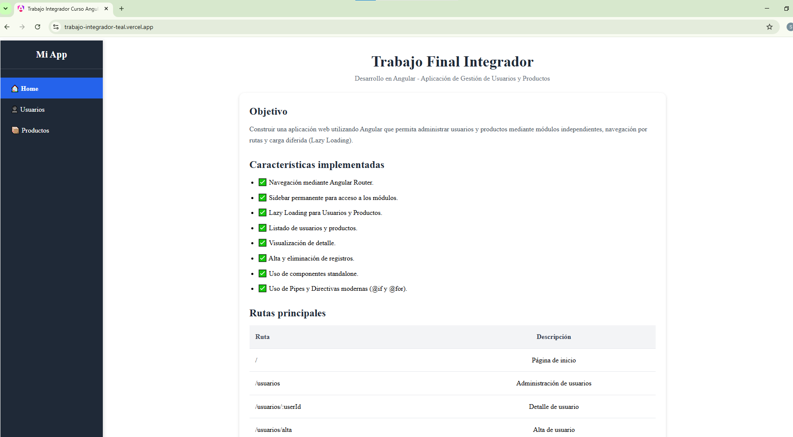
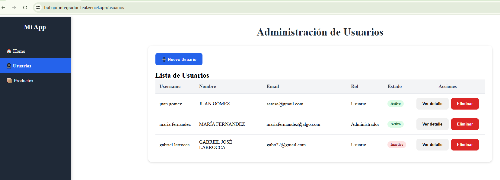
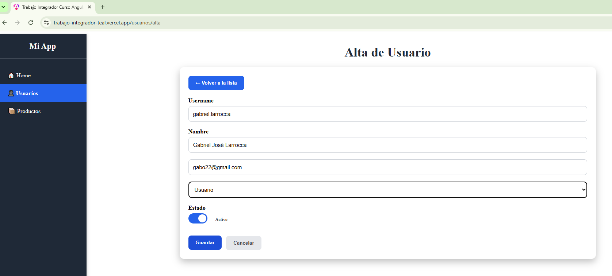
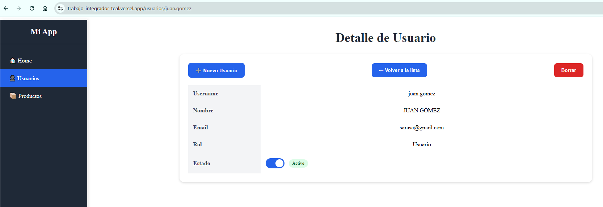
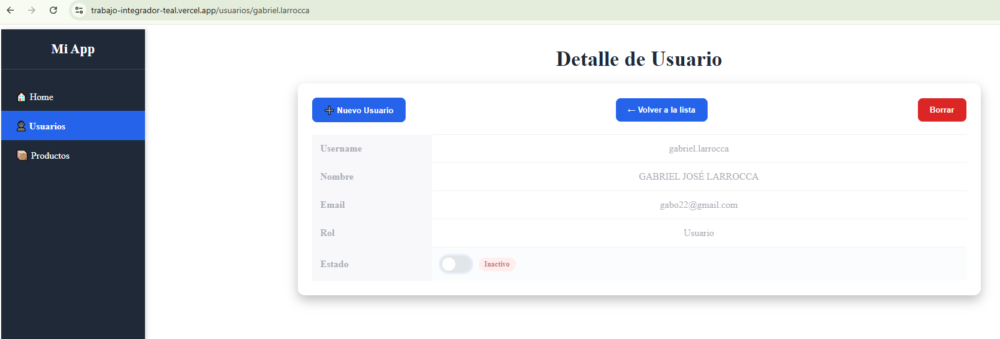
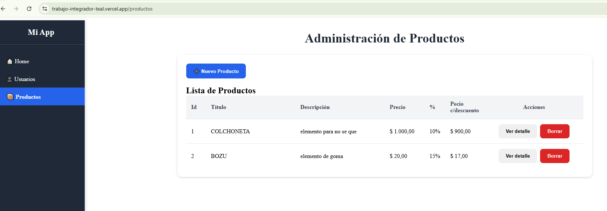
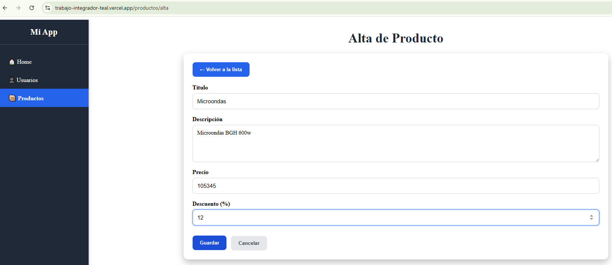
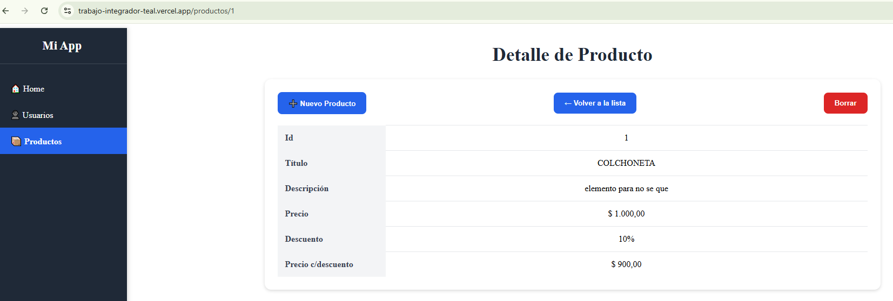

# Trabajo Final Integrador - Angular

## Descripción

Este proyecto consiste en el desarrollo de una aplicación web de gestión de usuarios y productos utilizando Angular. El objetivo principal es aplicar los conceptos vistos durante la cursada, incluyendo componentes standalone, routing, lazy loading, comunicación entre componentes, servicios, pipes y navegación mediante Angular Router.

La aplicación se encuentra organizada en módulos independientes que permiten administrar información de usuarios y productos a través de una interfaz sencilla y amigable.

## Consideraciones sobre los Datos

Con el objetivo de mantener el alcance del proyecto alineado con los contenidos del curso, no se implementó una capa de persistencia ni integración con fuentes de datos externas.

La información de usuarios y productos se administra mediante listas en memoria mantenidas por servicios de Angular. Esto permite demostrar los conceptos de componentes, servicios, navegación, comunicación entre componentes y gestión de estado básicos sin incorporar complejidades asociadas a bases de datos o almacenamiento persistente.

Como consecuencia, los cambios realizados durante la ejecución de la aplicación (altas, bajas o modificaciones) se conservan únicamente mientras la aplicación permanece activa y se pierden al recargar la página.

## Funcionalidades Implementadas

### Inicio

* Pantalla principal con información general del proyecto.
* Sidebar de navegación permanente.
* Acceso directo a los módulos de Usuarios y Productos.

#### Captura: Inicio
 

### Gestión de Usuarios

* Listado de usuarios.
* Alta de nuevos usuarios.
* Visualización de detalle de usuario.
* Eliminación de usuarios.
* Navegación mediante rutas parametrizadas.
* Cambio de estado del usuario

#### Captura: Usuarios
 

#### Captura: Usuarios - Alta
 

#### Captura: Usuarios - Detalle
 

#### Captura: Usuarios - Cambio de Estado
 

### Gestión de Productos

* Listado de productos.
* Visualización de detalle de producto.
* Eliminación de productos.
* Aplicación de pipes para formateo de precio y descuentos.
* Navegación mediante rutas parametrizadas.

#### Captura: Productos
 

#### Captura: Productos - Alta
 

#### Captura: Productos - Detalle
 

## Aspectos Técnicos

Durante el desarrollo se implementaron las siguientes características de Angular:

* Componentes Standalone.
* Angular Router.
* Lazy Loading de módulos.
* RouterLink y RouterOutlet.
* Inputs y Outputs mediante Signals.
* Directivas de control de flujo (`@if` y `@for`).
* Servicios para la administración de datos.
* Pipes integrados y personalizados.
* Navegación entre vistas mediante rutas parametrizadas.
* Uso de event binding ((change)) y property binding ([checked]).
* Aplicación dinámica de clases ([class.usuario-inactivo]).

## Estructura de Navegación

| Ruta                 | Descripción          |
| ---------------------| -------------------- |
| `/`                  | Página principal     |
| `/usuarios`          | Listado de usuarios  |
| `/usuarios/alta`     | Alta de usuario      |
| `/usuarios/:userId`  | Detalle de usuario   |
| `/productos`         | Listado de productos |
| `/productos/:id`     | Detalle de producto  |
| `/productos/alta`    | Alta de producto     |

## Despliegue

Se realizó en Vercel
https://trabajo-integrador-teal.vercel.app/

## Autor
Carolina Boerr

Trabajo realizado como parte del Trabajo Final Integrador de la materia Desarrollo en Angular.
